<div align="center">

# ⏱️ Distributed Real-Time Systems — Timing Analysis Toolkit

### *Will the task finish on time? Will the network packet arrive on time? Two projects, two answers.*

A personal study of **timing guarantees** in safety-critical computer systems — from how a car's CPU shares time between brakes and airbags, to how an industrial network ferries video, control, and email traffic without anyone missing their slot.

[](https://www.python.org/)
[](https://matplotlib.org/)
[](https://numpy.org/)
[]()
[]()
[]()

</div>

---

## 🤔 What is "real-time", in one sentence?

> **A real-time system is not one that's *fast* — it's one that's *predictable*. Finishing in 100 ms is fine if the deadline is 200 ms; finishing in 5 ms is a failure if you finished at the *wrong* 5 ms.**

A self-driving car can have the world's fastest GPU, but if the airbag-release decision is *occasionally* late by 30 ms, people die. The job of real-time analysis is to **mathematically prove** that the *worst possible case* still meets every deadline.

This repository contains two projects exploring that question at two very different scales:

| | Scope | The Question | Tool |
|---|---|---|---|
| **🧠 Project 1** | A single CPU running many tasks | *Will every task finish before its deadline?* | DM vs EDF scheduling analysis |
| **🌐 Project 2** | A switched Ethernet network carrying many streams | *Will every network frame arrive before its deadline?* | TSN Credit-Based Shaper WCD analysis |

---

# 🧠 Project 1 — DM vs EDF Scheduling

> **"Two cooks, one stove. Who decides what gets cooked next?"**

### The Setup

Imagine a single CPU with a list of recurring tasks — each task has:

| Symbol | Meaning | Restaurant analogy |
|:---:|---|---|
| **C** | Worst-case execution time | How long a dish takes to cook |
| **T** | Period (how often it must run) | The dish must be served every T minutes |
| **D** | Deadline (≤ T usually) | Must be on the customer's table within D minutes |
| **U** | Utilisation = C/T | What fraction of stove-time the dish needs |

Every task fires *forever*, on a fixed schedule. The CPU can only run one task at a time. So when **two tasks become ready at the same instant**, which one runs first?

### Two Strategies

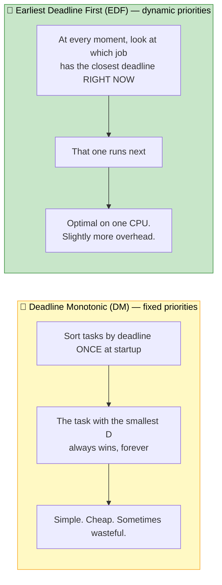

### What this project does

* ✅ Implements **Response Time Analysis (RTA)** for DM — iteratively computes worst-case response time of every task.
* ✅ Implements the **Processor Demand Bound Function** for EDF — checks whether any future busy period can overload.
* ✅ Implements a **discrete-event simulator** so analytical predictions can be cross-checked against actual runs.
* ✅ Runs on **two large datasets**: an automotive benchmark and `uunifast`-generated random task sets at utilisations 0.3 → 1.0.
* ✅ Includes **15 hand-crafted task sets** that probe specific edge cases (high utilisation, constrained deadlines).
* ✅ Produces **Gantt charts** showing exactly when each task runs under each policy.

### The Headline Result

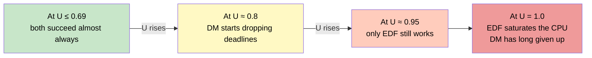

EDF is *optimal* on a single CPU — it accepts every task set that any algorithm could accept. DM is *simpler* — it doesn't need to recompute priorities every tick, but it pays for that simplicity by giving up earlier.

### 📊 The Plots

<div align="center">

#### Schedulability vs Utilisation (uunifast benchmark)
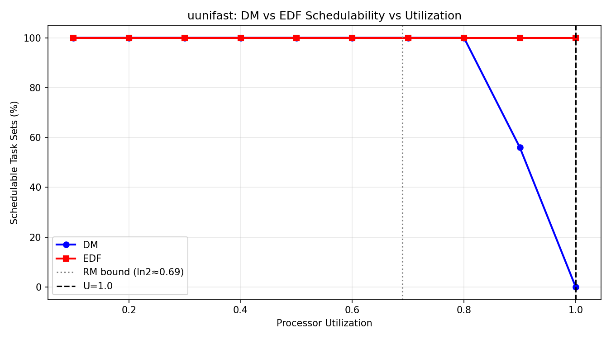

*Each line = a scheduling policy. X axis = how busy the CPU is. Y axis = % of task sets that meet all deadlines. EDF holds its 100 % bar much longer than DM.*

#### A Gantt Chart from the Simulator
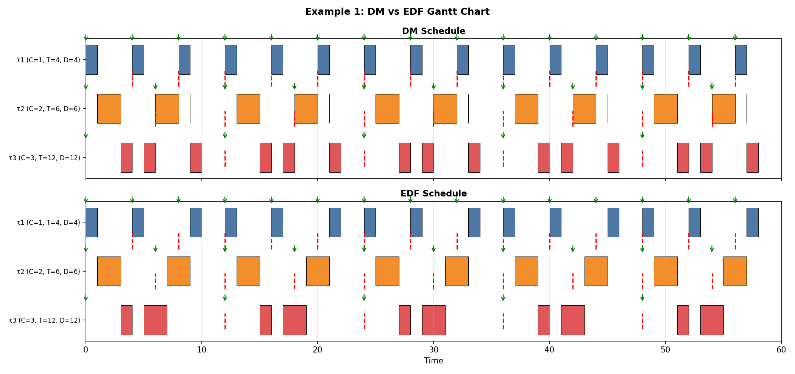

*Each row is a task. Each bar is one execution. Vertical dotted lines are deadlines. Above = DM, below = EDF, same task set.*

#### Where EDF Beats DM
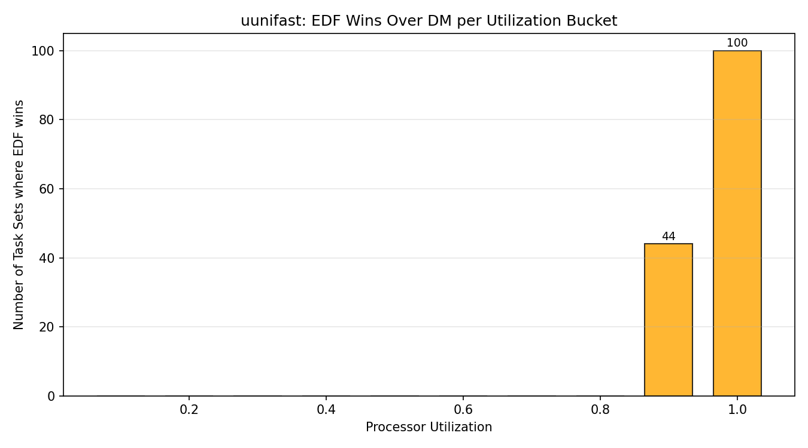

*Yellow zone: utilisations where DM fails but EDF succeeds. This is the "free performance" EDF gives you.*

#### Automotive Benchmark Results
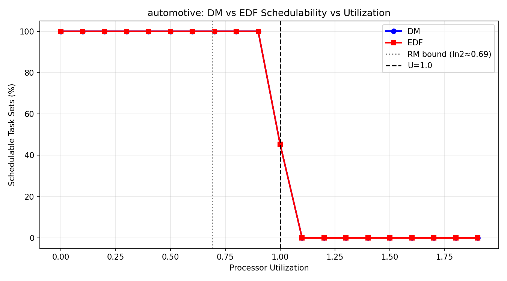

*Real engine-control task sets behave very differently from random ones — periods cluster around harmonics (1 ms, 5 ms, 10 ms, 100 ms…), which DM exploits.*

</div>

### 📂 Project 1 Files

```
Mini_Project1/
├── mini_project1.py            1,479 lines — RTA, DBF, simulator, plotting
├── README.txt                  original style readme
├── console_output.txt          full run log
├── custom_testcases/           15 hand-crafted CSV task sets
│   ├── 0.3_utilization/
│   ├── 0.5_utilization/
│   ├── 0.6_utilization/
│   ├── 0.8_utilization/
│   ├── 0.85_utilization/
│   ├── 0.9_utilization/
│   ├── 1.0_utilization/
│   └── constrained/            tasks with D < T
└── results/                    16 generated PNGs
```

---

# 🌐 Project 2 — TSN Credit-Based Shaper WCD

> **"Three lanes of traffic on a one-lane bridge. How do we guarantee the ambulance still gets through?"**

### The Setup

A **Time-Sensitive Network** (TSN) is essentially a switched Ethernet network where some traffic *cannot* be late — for example, audio/video in a recording studio, or steering signals in a car.

The challenge: a network link can only send one frame at a time. If high-priority frames *always* win, **low-priority frames starve**. So TSN uses a clever scheme called the **Credit-Based Shaper (CBS)** to give every traffic class a guaranteed share — without starving anyone.

### How CBS Works (the "credit" analogy)

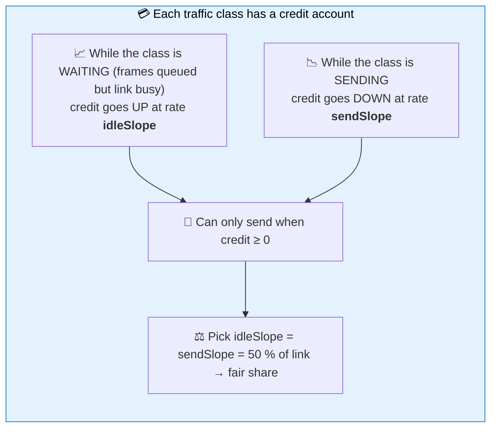

Three priority classes share each link:

| Class | Priority | Typical use | Tolerance |
|---|:---:|---|---|
| **🔴 AVB-A** | Highest | Live audio, control loops | Microseconds |
| **🟡 AVB-B** | Middle | Video, telemetry | Single-digit ms |
| **⚫ Best-Effort (BE)** | Lowest | Email, file transfer, web | No deadline |

### What this project does

* ✅ Implements the **analytical Worst-Case Delay (WCD)** formula from Cao 2016 / Maxim 2017 — a fixed-point iteration that bounds the worst possible delay for every stream.
* ✅ Implements a **discrete-event TSN simulator** — actually models the credit account tick-by-tick, frame-by-frame.
* ✅ Implements **Strict Priority (SP)** as a baseline so we can quantify CBS's benefit.
* ✅ Runs **six scenarios** ranging from sanity-check (1 stream per class) to stress-test (near-capacity) to starvation demonstration.
* ✅ Sensitivity-sweeps the **idleSlope** parameter to show the bandwidth-vs-latency trade-off.

### The Six Scenarios

| # | Topology | Streams | Demonstrates |
|:---:|---|---|---|
| **1** | 1 hop | 1A, 1B, 1BE | Baseline — does the math match the simulator? |
| **2** | 1 hop | 3A, 3B, 2BE | Realistic mixed industrial workload |
| **3** | 1 hop | Heavy mix | Near-capacity stress test, varied frame sizes |
| **4** | **2 hops** | Same as #2 | How WCD scales when frames cross multiple switches |
| **5** | 1 hop | BE-starvation setup | The headline result: CBS protects BE, SP starves it |
| **6** | 1 hop | idleSlope sweep | What if we change the 50/50 split to 30/70 or 70/30? |

### 📊 The Plots

<div align="center">

#### CBS vs Strict Priority — Worst-Case Delay
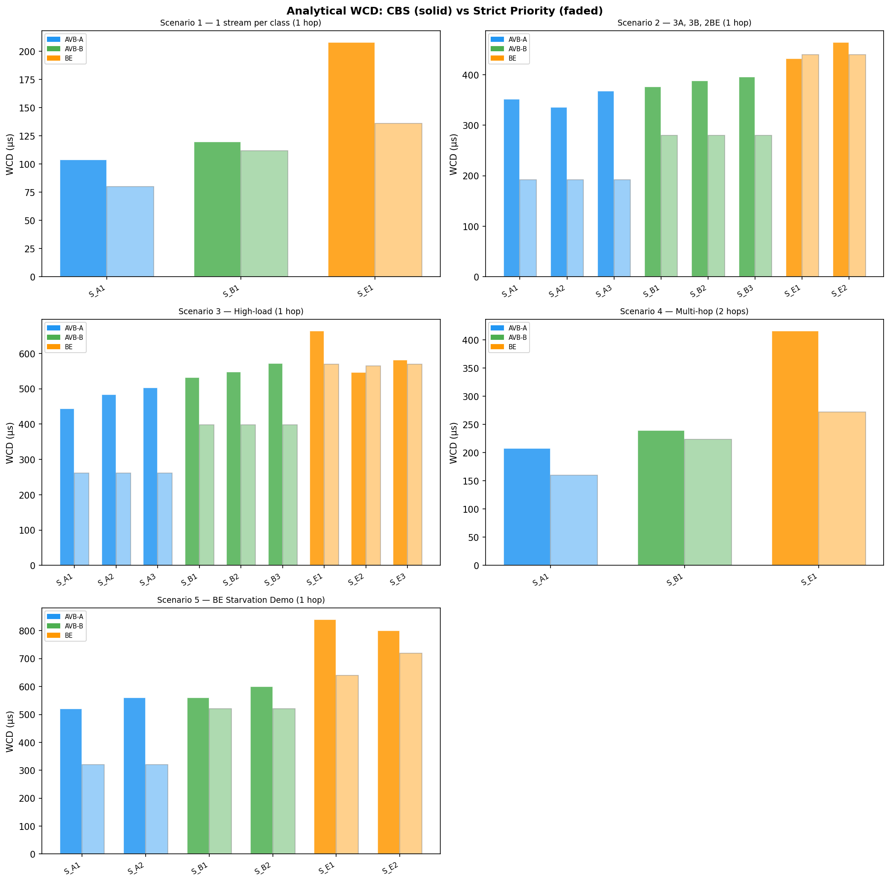

*Side-by-side WCD bars across 5 scenarios. CBS is slightly higher for AVB-A traffic (the price of fairness) but dramatically lower for Best-Effort.*

#### Analytical Math vs Real Simulation
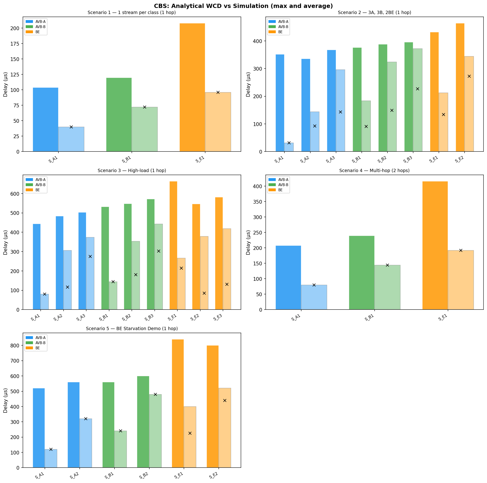

*The analytical bound (red) is always above the simulator's observed max (blue) and average (grey) — exactly what a correct upper bound should look like. The gap is the price of "worst-case-ness".*

#### CBS Credit Trace
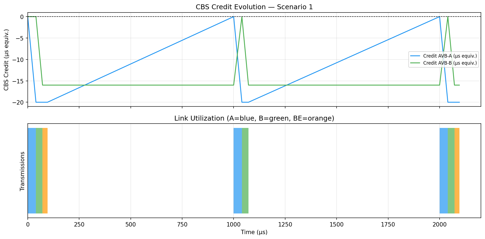

*The "credit account" for an AVB-A stream over time. Sawtooth pattern: rises while waiting, drops when sending, capped at hi/lo credit limits. This is CBS doing its job.*

#### Best-Effort Starvation Demo
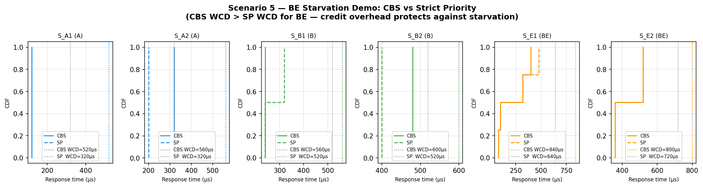

*Two CDFs. With Strict Priority (red) some BE frames never finish — the tail goes to infinity. With CBS (blue) every BE frame completes. This is **why CBS exists**.*

#### Response Time Distribution
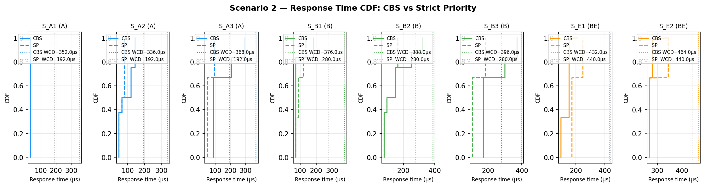

*Full distribution of frame delays in the realistic mixed-load scenario. AVB-A is tight, AVB-B is moderate, BE is wide but bounded.*

#### idleSlope Sensitivity
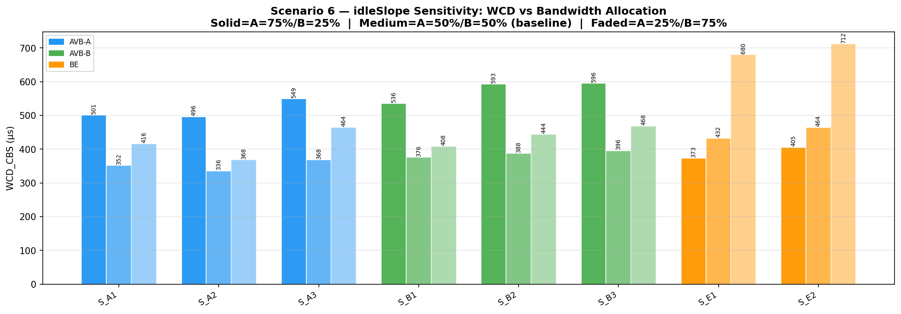

*Sweep of CBS's main tuning knob. Giving more bandwidth to AVB-A lowers its delay (good) but starves AVB-B (bad). The "fair" 50/50 default is a defensible trade-off.*

</div>

### 📂 Project 2 Files

```
Mini_Project2/
├── mini_project2.py            1,204 lines — analytical WCD, simulator, plotting
├── README_mp2.txt              original style readme
├── console_output.txt          full run log including JSON test case
└── plots/                      6 generated PNGs
```

---

## 🧪 The Math, in Plain English

| Idea | What it does | Where it's used |
|---|---|---|
| **Response Time Analysis (RTA)** | Iteratively computes a task's worst-case completion time by adding interference from higher-priority tasks until the value converges. | P1 — DM schedulability |
| **Processor Demand Bound Function (DBF)** | Counts the total work that must finish in any interval of length L. If this ever exceeds L, you cannot schedule. | P1 — EDF schedulability |
| **uunifast** | A standard algorithm for generating random task sets at a target utilisation, used to benchmark schedulers fairly. | P1 — synthetic benchmark |
| **Fixed-Point Iteration on WCD** | The analytical CBS bound is recursive (delay depends on credit which depends on delay). Iterate to convergence. | P2 — analytical WCD |
| **Discrete-Event Simulation** | Model time as a sorted queue of events (arrival, transmission start/end). Step through one event at a time. | Both projects |

---

## 🚀 How to Run

### Prerequisites

```bash
# Python 3.10 or later
pip install matplotlib numpy
```

### Project 1

```bash
cd Mini_Project1

# Run with the included custom test cases
python3 mini_project1.py

# Save the full log
python3 mini_project1.py 2>&1 | tee console_output.txt
```

> 📝 The reference `test_examples/` folder and the automotive / uunifast batch datasets are **not** bundled in this repo. Pre-computed results from those runs are in `results/` and `console_output.txt`.

### Project 2

```bash
cd Mini_Project2

# Run all 6 scenarios + optional JSON test case
python3 mini_project2.py

# Save the full log
python3 mini_project2.py 2>&1 | tee console_output.txt
```

> 📝 For the optional JSON test case:
> ```bash
> git clone https://github.com/paulpop/tsn-test-cases ~/Desktop/tsn-test-cases
> ```

---

## 📊 Project Stats

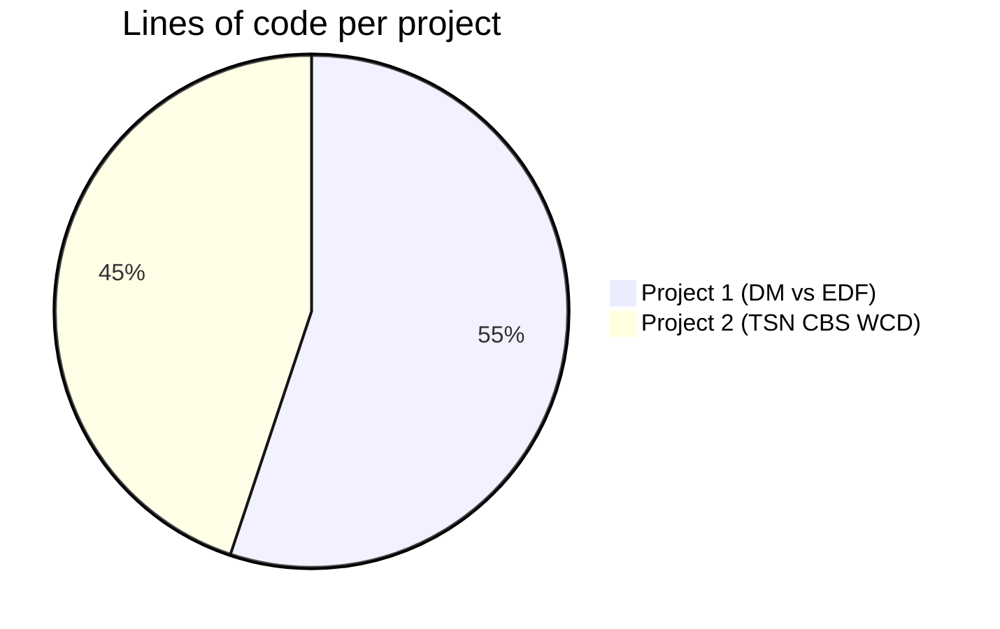

| 📈 Metric | Project 1 | Project 2 |
|---|:---:|:---:|
| Python LOC | 1,479 | 1,204 |
| Generated plots | 16 | 6 |
| Custom test cases | 15 | 6 scenarios |
| Algorithms implemented | RTA + DBF + simulator | Analytical WCD + simulator |
| Dependencies | matplotlib | matplotlib + numpy |

---

## 📚 References

The implementations follow standard results from the real-time systems literature:

* Liu & Layland 1973 — *Scheduling Algorithms for Multiprogramming in a Hard-Real-Time Environment*. The foundational paper.
* Audsley et al. 1993 — *Applying New Scheduling Theory to Static Priority Pre-emptive Scheduling*. Response Time Analysis.
* Cao et al. 2016 (WFCS) — analytical Worst-Case Delay bound for AVB-A in 802.1BA networks.
* Maxim & Song 2017 — refined Worst-Case Delay analysis for the Credit-Based Shaper.
* IEEE 802.1Qav — Credit-Based Shaper standard.
* IEEE 802.1Q-2018 — consolidated TSN specification.

---

## 📜 License

Personal project. Use, learn, fork freely.

---

<div align="center">

### Made with 🧠, ☕ and a stubborn refusal to let any task miss its deadline.

*If a frame arrives early, that's lucky. If a frame arrives on time, that's engineering.* 📡✨

</div>
